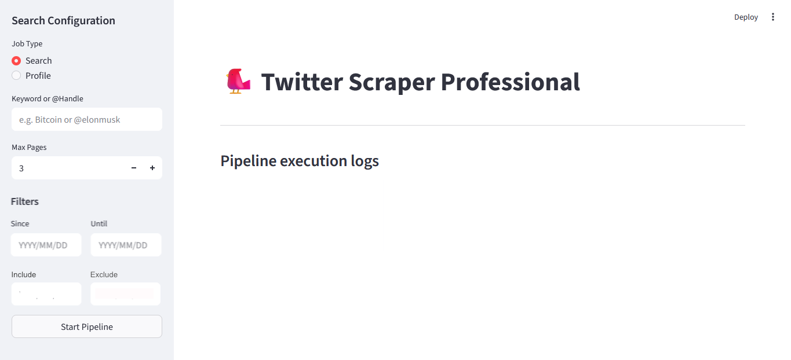

# 🤖 Full Stack Twitter Scraper (Asynchronous)

A high-performance, asynchronous Twitter scraping solution built with Python. This tool leverages Nitter instances to bypass rate limits and provides a beautiful Streamlit dashboard for managing scraping tasks, monitoring progress, and exporting data in multiple formats.

## Key Features
- **Parallel Scraping**: Run multiple keyword or profile scraping jobs concurrently using `httpx` and `asyncio`.
- **Search & Profile Modes**: Scrape by keywords with advanced filters (date, engagement) or target specific user profiles.
- **Smart Filtering**: Built-in support for Nitter filters (media, links, replies, etc.) and engagement thresholds.
- **Unified Data Schema**: Extracts rich tweet metadata including IDs, timestamps, full text, media URLs, engagement counts, and relationship data (RTs/Replies).
- **Streamlit Dashboard**: A modern web interface to configure tasks, view live execution logs, and download results.
- **Data Export**: Seamlessly export deduplicated data to JSONL and CSV formats.

## Screenshots & Demos

### Dashboard Overview


### Real-time Pipeline Monitoring


### Result Export Demo


## Project Structure

```text
Full Stack Twitter Scraper/
├── data/               # Raw HTML and config storage for each session
├── legacy/             # Previous script versions
├── screenshots/        # Project visuals and demos
├── src/                # Main source code
│   ├── core/           # Core scraping logic and engine
│   ├── infrastructure/ # Networking and system integrations
│   ├── services/       # Business logic and parsing services
│   ├── ui/             # Streamlit dashboard implementation
│   └── utils/          # Shared helper functions
├── main.py             # Entry point
├── requirements.txt    # Project dependencies
└── README.md           # Project documentation
```

## Tech Stack
- **Engine**: Python, Asyncio, HTTPX
- **Frontend**: Streamlit
- **Parsing**: BeautifulSoup4
- **Data**: Pandas, JSONL

## Getting Started
1. Install dependencies: `pip install -r requirements.txt`
2. Run the dashboard: `streamlit run src/ui/app.py`
3. Define your tasks and start scraping!
